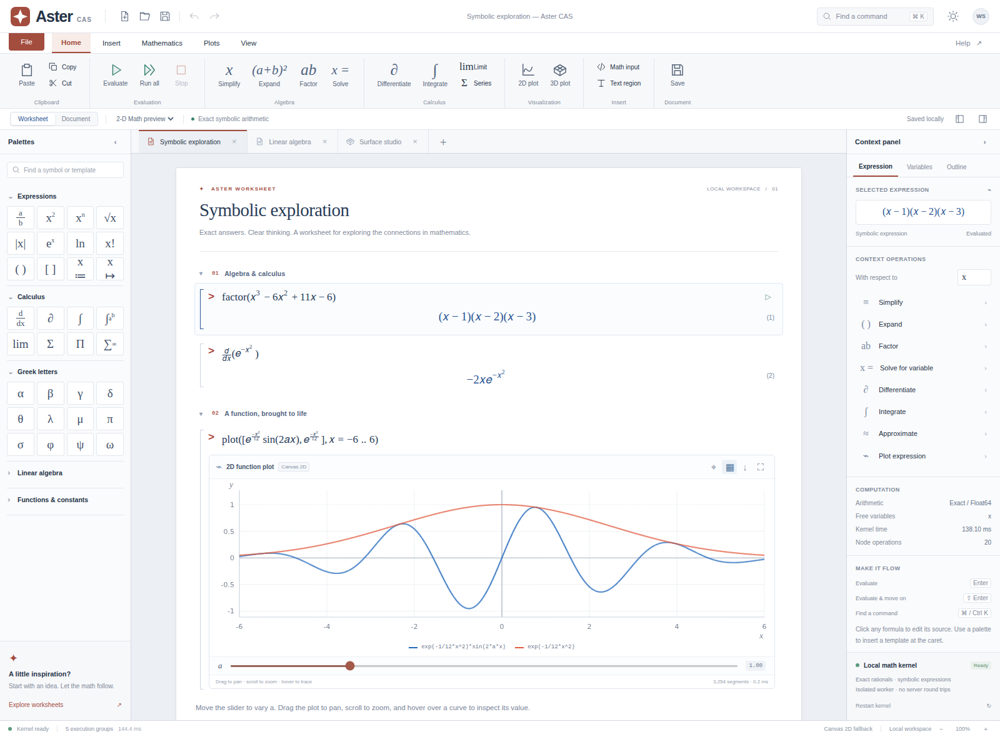

# Aster CAS

An independent, Maple-inspired mathematical worksheet application, written in plain HTML, CSS, and JavaScript. Aster combines an original symbolic kernel, editable worksheets, native MathML, and a retained WebGPU plotting backend. There is no server-side computation, framework, CDN, external font, or runtime dependency.

**Version 0.1.0 — a working, tested foundation, not a replacement for the complete Maple product or language.** Supported operations, numerical methods, and boundaries are explicit below and in `docs/ARCHITECTURE.md`.



## Run it

### Single-file application

Open `dist/index.html` in a modern browser. It contains the complete application, styles, and Blob-worker kernel. It makes no network requests. Local-file WebGPU and storage behavior varies by browser; the app reports its actual plot backend and falls back to Canvas 2D.

### Source application — recommended for development and WebGPU

From this directory:

```sh
python3 -m http.server 8765
```

Open `http://localhost:8765`. The source application uses native ES modules and a module worker, so it needs an HTTP origin rather than opening the source `index.html` directly as a file. WebGPU requires browser support, a suitable adapter, and a permitted secure context; localhost or an HTTPS static host is recommended.

```sh
npm test             # 98 kernel checks, built-in Node test runner
npm run build        # reproducible, dependency-free single-file build
npm start            # the local Python static server
```

No `npm install` is needed. Node 22 was used to test and build this version. Python 3 is only needed for the convenience server and browser tests, not the application.

## What is implemented

### Worksheet and editor

Multiple document tabs; editable titles, subtitles, prose, and collapsible sections; expression palettes with selected caret placeholders; a matrix builder; source editing with a 2-D MathML preview; blue typeset outputs and red input prompts; context operations; variables and outline inspectors; command search; keyboard execution; cell insertion, reordering, duplication, and deletion; bounded document undo/redo; light/dark themes; responsive layouts; and document/worksheet presentation modes.

Each evaluation rebuilds the document's definitions from the start through the selected cell, or through all cells for Run all. Editing marks downstream outputs stale. The kernel runs in a dedicated cancellable worker, with a per-cell wall-clock deadline and bounded algorithms.

**This is source editing with a typeset preview, not a structural WYSIWYG equation editor.** Clicking a formula reveals the source editor; the palettes modify the actual source at the caret.

### Symbolic and numerical engine

Exact BigInt integer/rational arithmetic and exact decimal literals; scalar canonicalization and like-term collection; bounded polynomial expansion and rational-root factorization; exact linear/quadratic and rationally reducible polynomial solving; derivatives with chain/product rules; rule-based indefinite integration; validated finite-interval definite integration with an adaptive Simpson fallback; selected finite limits; Taylor polynomials; finite sums/products; substitution; persistent variables and user-defined functions.

Dense matrices support addition, ordered multiplication, scalar multiplication, powers, determinant, inverse, transpose, trace, rank, and reduced row echelon form. Linear systems have a bounded exact solver. Other numerical tools include a residual-checked root scan/bisection solver, fixed-step scalar RK4 IVPs, and elementary descriptive statistics.

Approximate arithmetic and plotting evaluation use IEEE-754 binary64. Exact rational arithmetic is **not** arbitrary-precision floating-point arithmetic. The optional imaginary unit is symbolic; general complex numerical evaluation is not implemented.

### Real plots

2D function and sampled-ODE plots with grids, axes, multiple curves, pan, cursor-centered zoom, nearest-curve tracing, parameter sliders, and fit. 3D height-field surfaces have a real sampled mesh, smooth vertex normals, height coloring, orbit, shift-drag pan, zoom, wireframe, automatic rotation, and fit. Plot controls also provide full-window expansion and PNG export.

The WebGPU path uses WGSL vertex/fragment shaders, shared device/pipelines, 4× MSAA, depth testing, per-view uniform buffers, and reusable geometrically growing vertex buffers. The default 3D grid has 112 × 112 quads: **25,088 triangles**, when the function is finite over the sampled grid. Meshes are retained across camera changes. 2D hover tracing reuses both samples and geometry and redraws only its overlay.

The compatibility renderer uses actual Canvas 2D geometry, not a static image. Its 3D painter's algorithm has weaker occlusion and performance than a depth-buffered GPU renderer. The badge says **WebGPU** or **Canvas 2D** according to the active path. UI chrome and mathematical typography use DOM/CSS/MathML, not WebGPU.

### Files and privacy

Aster autosaves the workspace to localStorage when available. **File → Save** exports an editable, versioned `.aster` JSON document. Import validates its schema and regenerates outputs from source; it does not trust embedded HTML or JavaScript. Export includes standalone static HTML reports with MathML and plot PNGs, LaTeX text, calculation source, and per-plot PNG images. Browser printing is available. LaTeX export includes source and symbolic outputs, not embedded plot assets.

No account, analytics, telemetry, external requests, or remote execution is present. LocalStorage is neither encrypted storage nor a backup: save `.aster` files for documents you need to keep. Imported source is recalculated automatically within the bounded kernel. The custom parser does not execute JavaScript.

## Try these expressions

Use one expression per math cell. Definitions in earlier cells are replayed automatically.

```text
factor(x^3 - 6*x^2 + 11*x - 6)
diff(exp(-x^2), x)
int(x*exp(x), x)
int(exp(-x^2), x=0..1)
limit(sin(x)/x, x=0)
series(sin(x), x=0, 8)
solve(x^2 - 5*x + 6 = 0, x)
solve([2*x+y=5, x-y=1], [x,y])

A := Matrix([[2,1,0], [1,3,1], [0,1,2]])
inverse(A)
A * inverse(A)

f := x -> x^2 + 1
f(3)
plot([exp(-x^2/12)*sin(2*a*x), exp(-x^2/12)], x=-6..6)
plot3d(sin(a*x)*cos(y)*exp(-(x^2+y^2)/18), x=-5..5, y=-5..5)
ode(-0.35*y + sin(t), y=1, t=0..20)
```

Unassigned free variables in plots become sliders. An already assigned variable is substituted instead. Use explicit multiplication for `x*(x+1)`; `x(x+1)` means a function call. `^` is power, `:=` is assignment, `=` constructs an equation, and `..` constructs a range. One trailing `;` or `:` is accepted, but this is not Maple's statement language and `:` does not suppress output. Each cell accepts one expression, not multiple semicolon-separated statements.

## Shortcuts

| Action | Shortcut |
| --- | --- |
| Evaluate selected cell and its prefix | Enter |
| Evaluate, then advance | Shift+Enter |
| Insert math cell | Ctrl/Cmd+Enter |
| Evaluate whole worksheet | Ctrl/Cmd+Shift+Enter |
| Newline inside source | Alt+Enter |
| Complete a builtin command prefix | Tab |
| Find a command | Ctrl/Cmd+K |
| Save / open / new worksheet | Ctrl/Cmd+S / O / N |
| Document undo / redo | Ctrl/Cmd+Z / Shift+Z |
| Stop computation / leave expanded plot | Escape |
| Fit focused plot | Home or 0 |
| Command reference | F1 |

## Validation and boundaries

**98/98 Node kernel tests and 39/39 browser integration checks passed** in the supplied test environment. The browser checks exercise the actual standalone app and a real Blob worker, Canvas plots, editing, matrices, context actions, file validation/export, and responsive themes. The environment blocked browser URL navigation, so the suite used `about:blank` with explicit Storage/download fixtures. **A live WebGPU adapter, native origin persistence/downloads, and the HTTP ES-module application were not validated here.** `tests/browser_live.py` provides a separate normal-localhost validation harness, including `--require-webgpu`.

```sh
python3 -m pip install playwright
python3 -m playwright install chromium
python3 tests/browser_integration.py
python3 tests/browser_live.py
python3 tests/browser_live.py --require-webgpu --headed
```

For an existing Chromium executable, set `ASTER_CHROMIUM=/path/to/chromium`, or use the live harness's `--chromium` option. Browser installation and these development tools are not runtime dependencies.

See `docs/VALIDATION.md` for tested versus untested paths, `docs/COMMANDS.md` for command contracts, and `docs/ARCHITECTURE.md` for internals and algorithmic limits.

Important omissions include Maple packages and file compatibility, general assumptions/branch tracking, arbitrary-precision numerics, complete symbolic integration and limits, general algebraic solving, sparse matrices, PDE solvers, units, statistics packages, collaborative editing, a structural math editor, and a mobile touch-pinch gesture recognizer. Plots sample on the CPU; this is GPU rendering, not GPU CAS or compute-shader evaluation. This version is not independently certified for scientific, engineering, or safety-critical use.

## Source map

```text
index.html, styles.css    application structure and design tokens
js/app.js                documents, editor, commands, persistence, worker jobs
js/ui-data.js            palettes, icons, command examples, starter worksheets
js/worker.js             isolated sequential kernel protocol
js/core/ast.js           parser, expression IR, exact arithmetic, MathML/LaTeX, VM
js/core/algebra.js       symbolic rules, polynomials, matrices, numerical methods
js/core/kernel.js        typed dispatch, sessions, bindings, result contracts
js/render/plots.js       retained plot views, WebGPU and Canvas renderers
build.mjs                project-specific zero-dependency standalone bundler
```

MIT licensed. Maple is a trademark of its respective owner. Aster is an independent implementation; it contains no Maplesoft source, assets, or proprietary computation engine and is not affiliated with Maplesoft. The name is a project name, not a claim of trademark clearance.

Design/technical references: [Maple worksheet workflow](https://www.maplesoft.com/support/help/Maple/view.aspx?path=UserManual%2FChapter03), [Maple Context Panel](https://www.maplesoft.com/support/help/maple/view.aspx?path=worksheet%2Freference%2Fcontextpanel), [W3C WebGPU](https://www.w3.org/TR/webgpu/), [WGSL](https://www.w3.org/TR/WGSL/).
